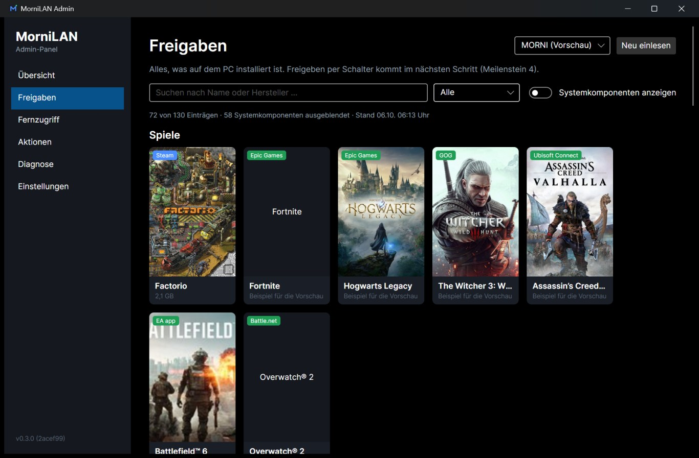
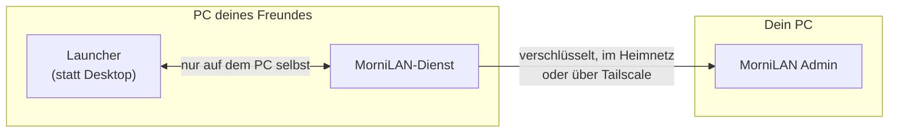
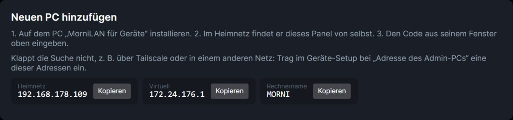
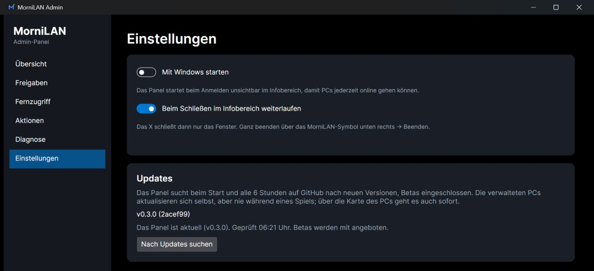

<p align="center">
  
</p>

<h1 align="center">MorniLAN</h1>

<p align="center">
  <b>Ein Windows-PC für Freunde und Familie: aufgeräumt, sicher und bequem aus der Ferne verwaltet.</b>
</p>

<p align="center">
  <a href="https://github.com/MoinMornhart/MorniLAN/releases"></a>
  <a href="https://github.com/MoinMornhart/MorniLAN/actions/workflows/ci.yml"></a>
  <a href="LICENSE"></a>
</p>

---

Du richtest einem Freund einen PC ein, auf dem er einfach spielen und ein paar Programme nutzen soll, ohne dass er
aus Versehen etwas kaputt macht und ohne dass du jedes Mal vorbeikommen musst?

**Genau dafür ist MorniLAN da.** Dein Freund meldet sich mit seinem eigenen Konto an und sieht statt des Windows-Desktops
einen aufgeräumten **Launcher** mit seinen Spielen und Apps. Du siehst und steuerst alles von deinem eigenen PC aus:
was installiert ist, was er starten darf, ob der PC läuft, und auf Wunsch per Fernzugriff auch seinen Bildschirm.
Das klappt im selben Heimnetz oder von unterwegs über [Tailscale](https://tailscale.com), ohne Cloud-Dienst und ohne
Portfreigaben am Router.

<p align="center">
  
  <br>
  <sub>Das Admin-Panel zeigt alle Spiele auf dem verwalteten PC, egal aus welchem Launcher (hier mit Beispiel-Spielen).</sub>
</p>

> [!NOTE]
> MorniLAN ist in **aktiver Entwicklung** (Beta). Verbinden, Erkennen, Freigaben, Updates, der Launcher mit Profilen,
> die Windows-Sperren je Konto, der Launcher-als-Desktop-Modus, der Fernzugriff (Steuerung) und der Einrichtungs-Assistent
> funktionieren bereits. Offen für den ersten stabilen Release sind vor allem die Tests zu zweit mit einem echten
> zweiten PC (Bild-Streaming, echte Installationen). Siehe [Fahrplan](#fahrplan).

## So funktioniert's

MorniLAN besteht aus **zwei Apps**:

| App | Für wen | Was sie macht |
|---|---|---|
| **MorniLAN Admin** | dich, auf deinem PC | Übersicht über alle PCs, Freigaben, Updates, später Fernzugriff und Aktionen |
| **MorniLAN für Geräte** | den PC, den du verwaltest | läuft unsichtbar als Windows-Dienst, meldet sich bei deinem Panel und bringt den Launcher mit |



Der verwaltete PC baut die Verbindung **selbst** zu deinem Panel auf. Bei ihm muss also nichts von außen erreichbar sein.

## Einrichten in drei Schritten

1. **Auf deinem PC** das Admin-Setup installieren (ohne Admin-Rechte), das Panel öffnen und einmal **„Firewall einrichten“** klicken.
2. **Auf dem PC deines Freundes** das Geräte-Setup installieren (braucht einmal Admin-Rechte). Danach zeigt das MorniLAN-Fenster einen **Code**.
3. **Den Code** im Panel eingeben. Fertig, der PC erscheint in deiner Übersicht.

Im Heimnetz finden sich beide von selbst. Über Tailscale oder in einem anderen Netz trägst du im Geräte-Setup eine der
Adressen ein, die das Panel unter „Neuen PC hinzufügen“ anzeigt:

<p align="center">
  
</p>

**Download:** Die Setups liegen unter [Releases](https://github.com/MoinMornhart/MorniLAN/releases).

| Für | Datei | Rechte |
|---|---|---|
| deinen PC | `MorniLAN-Admin-Setup-<Version>.exe` | keine Admin-Rechte nötig |
| den verwalteten PC | `MorniLAN-Geraete-Setup-<Version>.exe` | einmal Admin-Rechte (Dienst + Firewall) |

Vorabversionen (`-beta`) zeigt GitHub nicht als „neueste Version“ an, sie stehen aber in der Liste der Releases.
Ausführliche Anleitung mit Fehlersuche: [docs/einrichtung.md](docs/einrichtung.md).
Alle Funktionen Schritt für Schritt erklärt: [**Admin-Handbuch**](docs/handbuch.md).

## Was MorniLAN kann

| | Funktion | Stand |
|---|---|---|
| 🔗 | **Finden und koppeln:** PCs im Heimnetz finden sich automatisch, gekoppelt wird mit einem Code, danach erkennen sich beide an ihrem Zertifikat | ✅ fertig |
| 📊 | **Übersicht:** online/offline, CPU, Arbeitsspeicher, Laufwerk | ✅ fertig |
| 🎮 | **Spiele und Programme erkennen:** Steam, Epic Games, GOG, Ubisoft Connect, EA app, Battle.net, Microsoft Store und alle installierten Programme, mit Covern und Icons. Systemkomponenten werden ausgeblendet | ✅ in der Beta |
| 🔄 | **Automatische Updates:** Das Panel bietet neue Versionen an, die PCs aktualisieren sich selbst, aber nie mitten im Spiel | ✅ in der Beta |
| ✅ | **Freigaben:** per Schalter festlegen, was im Launcher erscheint (Standard: alles frei), eigene Einträge für Programme, die MorniLAN nicht selbst findet | ✅ in der Beta |
| 🖥️ | **Launcher wie eine Konsole:** startet bei der Anmeldung im Vollbild, „Wer spielt?“ mit Profilen, Suche, „Zuletzt gespielt“, Leiste mit Uhr, Ton und WLAN, Bedienung auch mit dem Controller | ✅ in der Beta |
| 🎨 | **Profile gestalten:** jeder richtet sein Profil selbst ein – Farbe, Gaming-Hintergrund, eigenes Bild, Avatar, und ein optionales Passwort für die Profilauswahl | ✅ in der Beta |
| 🔒 | **Windows-Sperren:** je Konto wählen, ob es eingeschränkt wird (Admin-Konten nie); Einstellungen, Konsole, Registry, Task-Manager und Installieren sperrbar, mit Notfall-Entsperrung am PC | ✅ in der Beta |
| 📺 | **Fernzugriff:** seinen Bildschirm sehen und helfen (Sunshine + Moonlight). Immer sichtbar am PC, mit Erlauben/Ablehnen und Maus/Tastatur-Sperre | ✅ Steuerung in der Beta |
| 🙋 | **Hilfe anfordern:** ein Knopf im Launcher, du bekommst sofort einen Hinweis im Panel | ✅ in der Beta |
| 🛠️ | **Aktionen:** Programme per winget installieren/deinstallieren oder aus einer Adresse, Nachricht schicken, Neustart/Herunterfahren | ✅ in der Beta |

### Updates

Das Panel schaut beim Start und alle sechs Stunden auf GitHub nach neuen Versionen und installiert sich auf Knopfdruck
selbst neu. Die verwalteten PCs aktualisieren sich automatisch, warten aber, solange ein Spiel läuft. Jedes Setup wird vor
dem Start über seine Prüfsumme (SHA-256) geprüft.

<p align="center">
  
</p>

## Datenschutz und Sicherheit

- MorniLAN liest oder speichert **keine Zugangsdaten** (Steam, Discord usw.). Bei Steam & Co. meldet sich dein Freund ganz normal im jeweiligen Programm an.
- **Persönliche Dateien** auf dem verwalteten PC bleiben unangetastet.
- Eine laufende **Fernzugriffs-Sitzung** wird im Launcher immer deutlich angezeigt.
- Es gibt immer eine **Notfall-Entsperrung**, und dein Admin-Konto kann nie ausgesperrt werden.
- Die Verbindung ist mit TLS verschlüsselt, beide Seiten prüfen sich gegenseitig am Zertifikat. Es gibt **keinen Server dazwischen**.
- Für Spiele ohne eigenes Cover fragt der verwaltete PC einmal im Steam-Shop nach dem Bild. Dabei wird nur der Spielname übertragen.

## Fahrplan

- [x] 1. Grundgerüst: Projektmappe, gemeinsame Modelle, Build-Skript, CI
- [x] 2. Verbindung mit Pairing und Heartbeat (im Heimnetz mit zwei echten PCs getestet, Tailscale-Test steht noch aus)
- [x] 2.5 Einrichtung ohne Konsole: Setups, Windows-Dienst, Firewall per Knopf, Diagnose
- [x] 3. Programme und Spiele erkennen (alle großen Launcher, Cover, Icons)
- [x] Automatische Updates (vorgezogen aus Schritt 9)
- [x] 4. Freigaben (Schalter je PC, eigene Einträge, einfache Kacheln im Launcher)
- [x] 5. Launcher im Vollbild mit Profilen, Controller und Hilfe-Knopf
- [x] 6. Windows-Sperren je Konto und Notfall-Entsperrung (App Control folgt mit Prüfmodus)
- [x] 7. Fernzugriff: Steuerung, Anzeige am PC, Eingabesperre (Streaming-Test zu zweit steht aus); Sunshine wird bei Bedarf automatisch per winget eingerichtet
- [x] Launcher als echter Desktop (Kiosk/Shell-Ersatz) je Konto
- [x] 8. Aktionen: Programme installieren/deinstallieren, Nachricht, Neustart/Herunterfahren
- [x] Aufräumen: unnötige Apps erkennen und auf Bestätigung ausblenden
- [x] 9. Auto-Update gehärtet: Panel-Selbstheilung, Geräte-Verifikation nach Neustart, GitHub-Schonung (ETag)
- [x] 10. Einrichtungs-Assistent im Panel (Firewall + erstes Pairing) und Adressfeld am Gerät
- [x] 11. Feinschliff und Stabilität (gezielter Bug-Review)
- [ ] Erster stabiler Release v0.3.0 (nach den Tests zu zweit mit echtem zweiten PC)
- [ ] 12. Extras

Was sich zwischen den Versionen ändert, steht im [Changelog](CHANGELOG.md).

## Für Entwickler

<details>
<summary><b>Projektaufbau</b></summary>

| Projekt | Läuft auf | Aufgabe |
|---|---|---|
| `MorniLAN.Agent` | verwalteter PC, Windows-Dienst (LocalSystem) | Verbindung zum Panel, Status, Programme und Spiele erkennen, Sperren, Befehle, Selbst-Update |
| `MorniLAN.Launcher` | verwalteter PC, Shell des Benutzerkontos | Vollbild-Oberfläche, spricht nur lokal per Named Pipe mit dem Agent |
| `MorniLAN.Admin` | PC des Admins | Panel mit eingebautem Server (Kestrel + SignalR über TLS) |
| `MorniLAN.Shared` | – | gemeinsame Modelle, Protokoll, Update-Logik |
| `MorniLAN.Tests` | – | Unit- und Ende-zu-Ende-Tests (xUnit v3) |

Technische Entscheidungen:

| Thema | Wahl | Begründung |
|---|---|---|
| Laufzeit | .NET 10 (LTS), C# | aktuell, langfristig unterstützt |
| Oberfläche | Avalonia 12 (Fluent, dunkel) | ohne MSIX-Paket lauffähig, robust als Shell-Ersatz ohne Explorer |
| Verbindung | ASP.NET Core SignalR über TLS, gegenseitiges Zertifikat-Pinning | Agent verbindet sich nach außen, keine Portfreigabe beim Freund |
| Fernzugriff | Sunshine + Moonlight | jede Windows-Edition, zeigt die laufende Sitzung (RDP würde abmelden) |
| Sperren | App Control (WDAC) bzw. AppLocker je nach Edition, dazu ein Prozess-Wächter | Windows Home und Pro |
| Updates | eigene Setups (Inno Setup) über GitHub Releases, Prüfsumme Pflicht | dieselben Setups wie bei der Erstinstallation |

Mehr: [Admin-Handbuch](docs/handbuch.md), [Anforderungen](docs/anforderungen.md), [Verbindung](docs/verbindung.md).
</details>

<details>
<summary><b>Bauen und testen</b></summary>

Voraussetzung: [.NET 10 SDK](https://dotnet.microsoft.com/download) (`winget install Microsoft.DotNet.SDK.10`).
Neuen Entwicklungsrechner einrichten: `./tools/setup-dev.ps1` (installiert das SDK bei Bedarf, setzt die Git-Identität, baut und testet).

```powershell
./build.ps1                 # Build (Release)
./build.ps1 -Task Test      # Build + Tests
./build.ps1 -Task Publish   # self-contained win-x64
./build.ps1 -Task Installer # beide Setups (braucht Inno Setup 6: winget install JRSoftware.InnoSetup)
```

Build-Ausgaben landen lokal unter `%LOCALAPPDATA%\MorniLAN\artifacts` bzw. `…\publish`, auf CI unter `./artifacts`.

Einzeln starten:

```powershell
dotnet run --project src/MorniLAN.Admin
dotnet run --project src/MorniLAN.Launcher
dotnet run --project src/MorniLAN.Agent      # als Konsolen-App; Logs in %ProgramData%\MorniLAN\logs
```
</details>

<details>
<summary><b>Versionen und Branches</b></summary>

- SemVer, die Version steht **nur** in [`Directory.Build.props`](Directory.Build.props) (`VersionPrefix`).
- `main` = stabil, `dev` = Entwicklung, `feature/*` = ein Branch pro Meilenstein.
- Commits nach [Conventional Commits](https://www.conventionalcommits.org/) (`feat:`, `fix:`, `docs:` …).
- Ein Tag `v<Version>` (z. B. `v0.3.0` oder `v0.3.0-beta.5`) baut auf GitHub beide Setups und veröffentlicht sie als Release. Daraus holen sich Panel und Geräte ihre Updates.
</details>

## Lizenz

[MIT](LICENSE)
